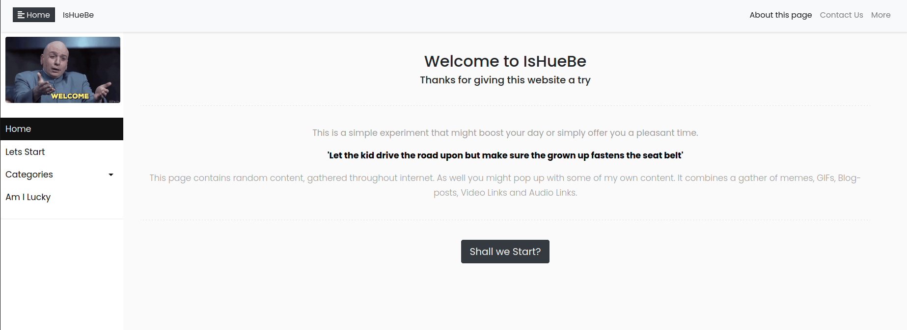

# IsHueBe

## Table of Contents
   

* [About the Project](#about-the-project)
* [Built With](#built-with)
* [Contributing](#contributing)
* [Contact](#authors)

#
 

  
  

 

## About the project

Web page project. Using Django, Python, MySql, Javascript, Bootstrap. The page is hosted in PythonAnywhere. You can check it here  
[LIVE PAGE] http://ishuebe.pythonanywhere.com/start/

## Screenshot Test
#

  

## Contributing

Contributions make the open-source community such an amazing place to learn, inspire, and create. Any contributions you make are **greatly appreciated**.

## Authors

👤 Sergio Cortes Satizabal

- Github: [@sergiocortessat](https://github.com/sergiocortessat)
- Twitter: [@sergiocortessat](https://twitter.com/sergiocortessat)
- LinkedIn: [@sergiocortessat](www.linkedin.com/in/sergio-cortes-satizabal-3b452194)

### Built With

* [PYTHON]
* [DJANGO]
* [BOOTSTRAP]

## 📝 License

This project is [MIT](https://github.com/sergiocortessat/sergiocortessat/blob/main/LICENSE) licensed.

